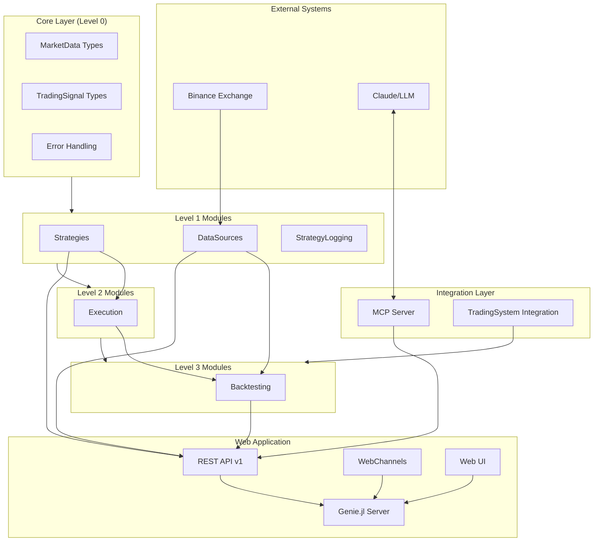
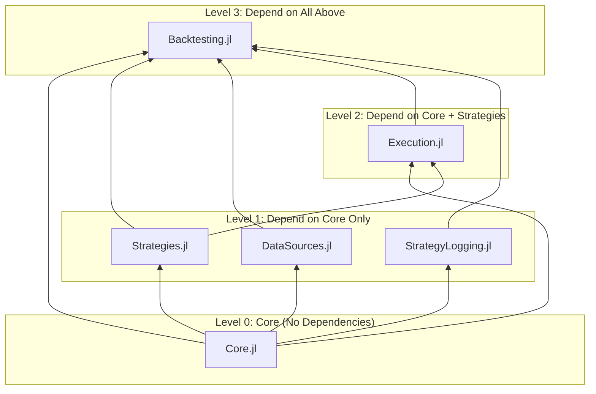
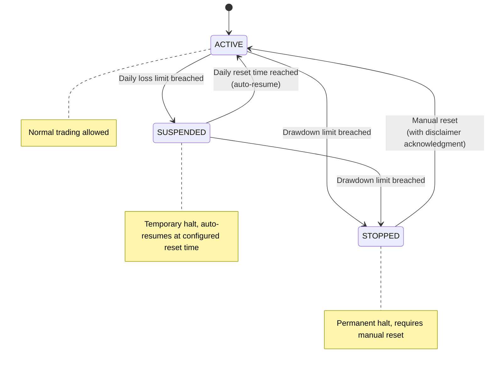
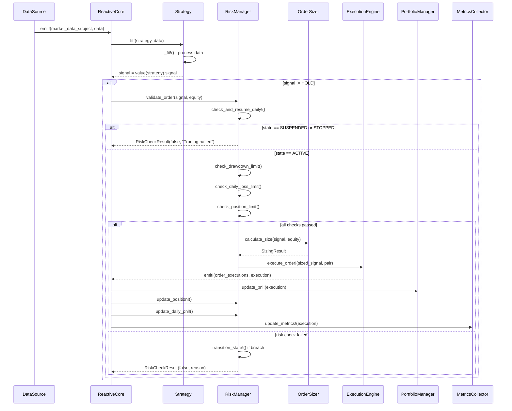
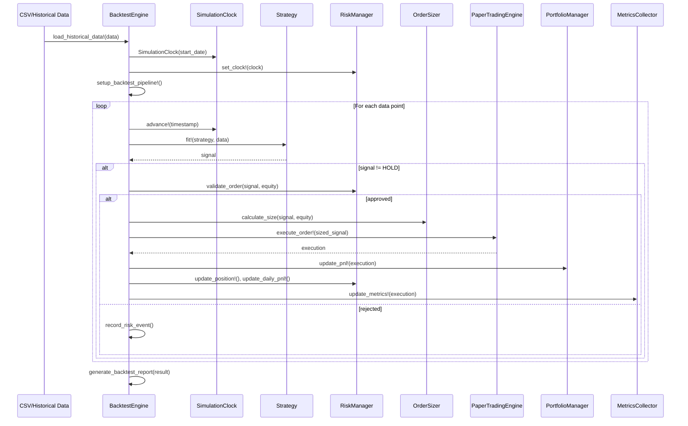
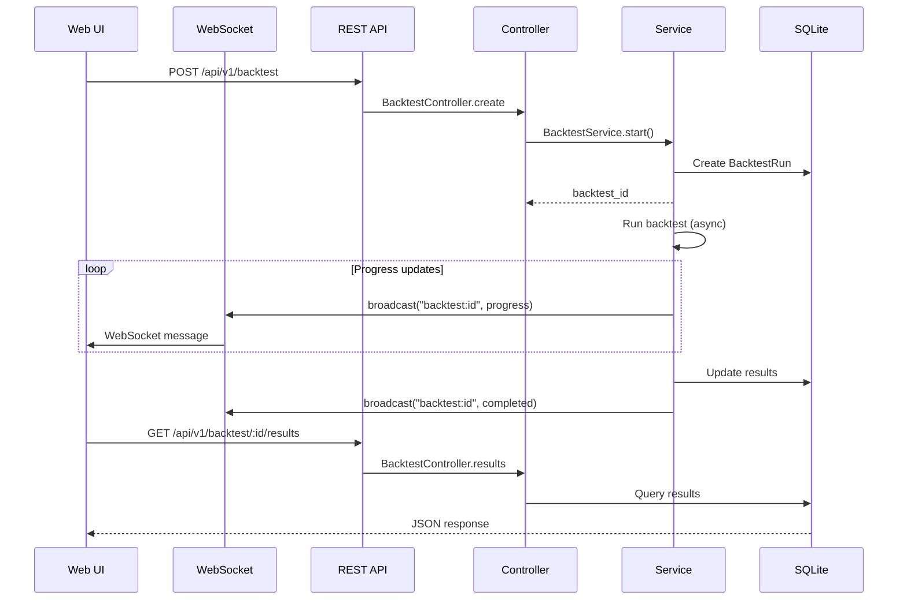
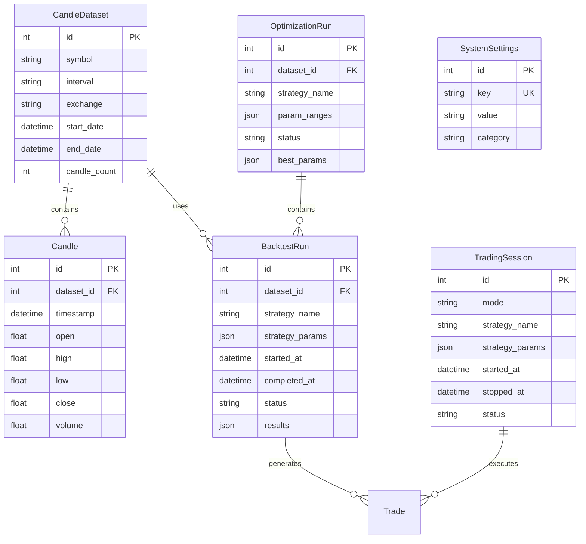

# ReactiveTradingSystem Wiki

Comprehensive documentation for the ReactiveTradingSystem - a modular algorithmic trading platform built with Julia.

## Table of Contents

1. [Project Overview](#project-overview)
2. [Architecture Overview](#architecture-overview)
3. [Project Structure](#project-structure)
4. [Core Components](#core-components)
5. [Data Flow](#data-flow)
6. [Data Model](#data-model)
7. [API Reference](#api-reference)
8. [CLI Reference](#cli-reference)
9. [MCP Integration](#mcp-integration)
10. [Configuration](#configuration)
11. [Getting Started](#getting-started)
12. [Development Guide](#development-guide)

---

## Project Overview

### Purpose

ReactiveTradingSystem is a modular algorithmic trading platform that combines reactive programming with online statistics for real-time market analysis and automated trading execution. It supports paper trading, backtesting, and live trading with exchange integrations.

### Tech Stack

| Category | Technology |
|----------|------------|
| Language | Julia 1.12+ |
| Web Framework | Genie.jl |
| ORM | SearchLight.jl |
| Database | SQLite |
| Reactive Programming | Rocket.jl |
| Statistics | OnlineStatsBase.jl, OnlinePortfolioAnalytics.jl |
| Technical Indicators | OnlineTechnicalIndicators.jl |
| Exchange Integration | Binance.jl, HTTP.jl |
| Visualization | LightweightCharts.js |
| Real-time Communication | WebSockets (Genie WebChannels) |
| LLM Integration | ModelContextProtocol.jl |
| Export Formats | JSON3.jl, ToonFormat.jl |

### Key Features

- **Reactive Pipeline**: Stream-based data processing using Rocket.jl observables
- **Modular Architecture**: Selective imports - load only what you need
- **OnlineStatsBase Integration**: Strategies implement the `OnlineStat` interface for incremental updates
- **Multiple Trading Modes**: Paper trading, backtesting, and live trading
- **Built-in Strategies**: RandomStrategy, MACrossover, BuyAndHold
- **User Strategy Support**: Create and deploy custom strategies with dependency management
- **Web Interface**: Full-featured Genie.jl web application for backtesting and monitoring
- **MCP Integration**: Natural language interaction via Model Context Protocol for LLM integration
- **Real-time Updates**: WebSocket-based live updates for backtest progress and live trading

---

## Architecture Overview

### High-Level Architecture



### Module Dependency Hierarchy



### Design Patterns

| Pattern | Usage |
|---------|-------|
| Observer (Reactive) | Market data streams via Rocket.jl observables |
| Strategy | Pluggable trading strategies via `AbstractTradingStrategy` |
| Factory | `DataSourceFactory` for creating data sources |
| Circuit Breaker | Error handling and recovery in `ErrorRecoveryManager` |
| Template Method | OnlineStatsBase `_fit!` pattern for strategies |
| Adapter | `FastbackAdapter` for portfolio analytics |
| State Machine | Three-state risk management (ACTIVE/SUSPENDED/STOPPED) |

### Trading State Machine

The RiskManager implements a three-state behavior model for risk control:



| State | Behavior | Recovery |
|-------|----------|----------|
| `ACTIVE` | Normal trading allowed | N/A |
| `SUSPENDED` | Temporary halt due to daily loss | Auto-resumes at `daily_reset_time` |
| `STOPPED` | Permanent halt due to drawdown | Requires `reset_risk_state!(rm; acknowledge_disclaimer=true)` |

---

## Project Structure

```
ReactiveTradingSystem/
├── bin/
│   ├── rts                     # CLI entry point
│   └── mcp_server.jl           # MCP server for LLM integration
├── src/
│   ├── ReactiveTradingSystem.jl # Root module definition
│   ├── Core/                   # Level 0: Foundational types
│   │   ├── Core.jl             # Module definition
│   │   ├── MarketData.jl       # TradingPair, MarketData, TradingSignal
│   │   ├── ErrorHandling.jl    # Error types, CircuitBreaker
│   │   └── ReactiveCore.jl     # Rocket.jl reactive operators
│   ├── Strategies/             # Level 1: Strategy framework
│   │   ├── Strategies.jl       # Module definition
│   │   ├── AbstractStrategy.jl # AbstractTradingStrategy interface
│   │   ├── StrategyValue.jl    # OnlineStatsBase value() output
│   │   ├── StrategyMetrics.jl  # Performance & trading metrics
│   │   ├── StrategyLoader.jl   # User strategy discovery
│   │   ├── StrategyDependencies.jl # Per-strategy package management
│   │   └── builtin/            # Builtin strategies
│   │       ├── RandomStrategy/
│   │       ├── MACrossover/
│   │       └── BuyAndHold/
│   ├── DataSources/            # Level 1: Data sources
│   │   ├── DataSources.jl      # Module definition
│   │   ├── AbstractDataSource.jl
│   │   ├── BinanceDataSource.jl
│   │   ├── CSVDataSource.jl
│   │   ├── SimulatedDataSource.jl
│   │   ├── DataValidation.jl
│   │   └── DataQualityMonitor.jl
│   ├── Logging/                # Level 1: Strategy logging
│   │   ├── StrategyLogging.jl  # Module (named to avoid stdlib conflict)
│   │   ├── LogEntry.jl
│   │   ├── StrategyLogger.jl
│   │   └── WebSocketLogger.jl
│   ├── Execution/              # Level 2: Trade execution
│   │   ├── Execution.jl        # Module definition
│   │   ├── AbstractEngine.jl
│   │   ├── PaperTradingEngine.jl
│   │   └── LiveTradingEngine.jl
│   ├── Backtesting/            # Level 3: Backtesting
│   │   ├── Backtesting.jl      # Module definition
│   │   └── BacktestEngine.jl
│   ├── MCP/                    # MCP integration (on-demand)
│   │   ├── MCP.jl              # Module definition
│   │   ├── ResponseHelpers.jl
│   │   └── tools/              # MCP tool definitions
│   │       ├── BacktestTools.jl
│   │       ├── StrategyTools.jl
│   │       ├── DataTools.jl
│   │       ├── ExportTools.jl
│   │       └── QueryTools.jl
│   ├── cli/                    # CLI commands
│   │   ├── RTS.jl              # Main CLI module
│   │   └── commands/
│   │       └── strategy.jl     # Strategy commands
│   ├── portfolio/              # Portfolio management
│   │   ├── FastbackAdapter.jl  # Fastback.jl integration
│   │   └── PortfolioManager.jl # Position tracking
│   ├── risk/                   # Risk management
│   │   ├── RiskManager.jl      # Position/loss/drawdown limits
│   │   └── RiskValidationPipeline.jl
│   ├── sizing/                 # Order sizing algorithms
│   │   ├── OrderSizing.jl      # Module definition
│   │   ├── AbstractOrderSizer.jl
│   │   ├── PassthroughSizer.jl
│   │   ├── RiskAwareSizer.jl
│   │   ├── FixedPercentageSizer.jl
│   │   ├── KellyCriterionSizer.jl
│   │   └── VolatilityScaledSizer.jl
│   ├── alerts/                 # Alert system
│   ├── metrics/                # Metrics collection
│   ├── reporting/              # Dashboard & reports
│   └── TradingSystemIntegration.jl # Full system integration
├── web/                        # Genie.jl web application
│   ├── app/
│   │   ├── resources/          # Controllers & models
│   │   │   ├── backtest/
│   │   │   ├── candles/
│   │   │   ├── strategies/
│   │   │   ├── optimization/
│   │   │   ├── live/
│   │   │   └── settings/
│   │   └── services/           # Business logic
│   ├── db/
│   │   └── migrations/         # Database migrations
│   ├── config/
│   └── routes.jl               # API routes
├── tests/                      # Test suite
├── Project.toml                # Julia package manifest
├── CLAUDE.md                   # Claude Code instructions
└── WIKI.md                     # This documentation
```

---

## Core Components

### `TradingPair`

Represents a trading pair with base and quote currencies.

```julia
struct TradingPair
    base_currency::String   # e.g., "BTC"
    quote_currency::String  # e.g., "USDT"
end

# Example
pair = TradingPair("BTC", "USDT")
symbol = symbol_from_pair(pair)  # "BTCUSDT"
```

### `MarketData`

Market data structure with nanosecond-precision timestamps.

| Field | Type | Description |
|-------|------|-------------|
| `timestamp` | `Timestamp64` | Nanosecond-precision timestamp |
| `trading_pair` | `TradingPair` | The trading pair |
| `price` | `Float64` | Current price |
| `volume` | `Float64` | Trading volume |
| `bid` | `Float64` | Best bid price |
| `ask` | `Float64` | Best ask price |
| `metadata` | `Dict{String, Any}` | Additional metadata |

### `TradingSignal`

Trading signal generated by a strategy.

| Field | Type | Description |
|-------|------|-------------|
| `signal_type` | `SignalType.T` | BUY, SELL, or HOLD |
| `quantity` | `Float64` | Quantity to trade |
| `confidence` | `Float64` | Confidence level (0.0-1.0) |
| `timestamp` | `Timestamp64` | When signal was generated |
| `metadata` | `Dict{String, Any}` | Signal metadata |

### `AbstractTradingStrategy`

Base type for all trading strategies, implementing OnlineStatsBase pattern.

```julia
abstract type AbstractTradingStrategy <: OnlineStatsBase.OnlineStat{MarketData} end
```

**Required Interface:**

| Method | Description |
|--------|-------------|
| `_fit!(strategy, data)` | Process market data and update strategy state |
| `value(strategy)` | Return `StrategyValue` containing signal and metrics |
| `parameters(strategy)` | Return configurable parameters |

**Metadata Interface (Type-Level):**

| Method | Description |
|--------|-------------|
| `strategy_name(T)` | Internal identifier |
| `strategy_display_name(T)` | Human-readable name |
| `strategy_description(T)` | Detailed description |
| `strategy_categories(T)` | Category tags |
| `strategy_parameters(T)` | Parameter schema |

**Example Strategy Implementation:**

```julia
mutable struct MyStrategy <: AbstractTradingStrategy
    n::Int
    value::StrategyValue{Float64}
    # ... custom fields
end

function OnlineStatsBase._fit!(strategy::MyStrategy, data::MarketData)
    strategy.n += 1
    # Process data, generate signal
    signal = TradingSignal(SignalType.BUY, 0.1, 0.85, data.timestamp)
    strategy.value.signal = signal
end
```

### Builtin Strategies

| Strategy | Description | Key Parameters |
|----------|-------------|----------------|
| `RandomTradingStrategy` | Random signal generation for testing | `seed`, `trade_probability` |
| `MovingAverageCrossoverStrategy` | MA crossover signals | `short_window`, `long_window` |
| `BuyAndHoldStrategy` | Buy once and hold | `initial_buy_fraction` |
| `LogDebugStrategy` | Debugging strategy with log export | N/A |

### Order Sizing

The `OrderSizing` module provides position sizing algorithms that interpret signal quantity as conviction/intent and calculate appropriate position sizes.

| Sizer | Description | Key Parameters |
|-------|-------------|----------------|
| `PassthroughSizer` | Returns signal quantity unchanged (backward compatible) | None |
| `RiskAwareSizer` | Proactively respects RiskManager limits | None |
| `FixedPercentageSizer` | Always uses fixed percentage of equity | `percentage` |
| `KellyCriterionSizer` | Optimal sizing using Kelly formula | `max_kelly_fraction` |
| `VolatilityScaledSizer` | Adjusts size based on volatility | `target_volatility` |

```julia
# Example usage
sizer = RiskAwareSizer()
result = calculate_size(sizer, signal, 10000.0; risk_manager=rm)
# result.quantity is sized to respect max_position_size
```

### Risk Manager

Manages risk limits with three-state behavior (ACTIVE/SUSPENDED/STOPPED).

```julia
risk_manager = RiskManager(
    max_position_size = 5000.0,    # Max $ per position
    max_daily_loss = 500.0,        # Max daily loss allowed
    max_drawdown = 0.15,           # 15% max drawdown
    initial_equity = 10000.0,
    daily_reset_time = Time(0, 0)  # UTC reset time
)

# Validate an order
result = validate_order(risk_manager, signal, current_equity)
if result.approved
    # Execute trade
end

# Check trading state
state = get_trading_state(risk_manager)  # TradingState.ACTIVE, etc.

# Manual reset from STOPPED state
reset_risk_state!(risk_manager; acknowledge_disclaimer=true, current_equity=10000.0)
```

### Clock Abstraction

Supports both real-time and simulation modes:

```julia
# Real-time clock for live trading
clock = RealTimeClock()

# Simulation clock for backtesting
clock = SimulationClock(DateTime(2024, 1, 1))
advance!(clock, Hour(1))  # Advance by 1 hour

# Get current time
now_utc(clock)
today_utc(clock)
```

### `BacktestEngine`

Engine for running historical strategy tests.

```julia
config = BacktestConfig(
    start_date = Date(2024, 1, 1),
    end_date = Date(2024, 3, 31),
    initial_capital = 10000.0,
    commission_rate = 0.001,
    fill_ratio = 0.95,
    slippage_model = (price, side) -> price  # Custom slippage
)

strategy = MovingAverageCrossoverStrategy(short_window=10, long_window=30)

# Optional: Add risk management and order sizing
risk_manager = RiskManager(max_position_size=5000.0, max_daily_loss=500.0)
order_sizer = RiskAwareSizer()

engine = BacktestEngine(config, strategy, [TradingPair("BTC", "USDT")];
    risk_manager = risk_manager,
    order_sizer = order_sizer
)
load_historical_data!(engine, data)
result = run_backtest!(engine)
print_backtest_report(result)
```

### `TradingSystem`

Complete system integration for paper/live trading.

```julia
config = TradingSystemConfig(
    mode = TradingMode.PAPER,
    initial_capital = 10000.0,
    strategy = RandomTradingStrategy(),
    trading_pairs = [TradingPair("BTC", "USDT")]
)

system = TradingSystem(config)
start!(system)
# ... trading runs ...
stop!(system)
```

---

## Data Flow

### Reactive Pipeline Flow



### Backtest Data Flow



### Web Application Request Flow



---

## Data Model

### Entity Relationships



### BacktestRun Results Schema

The `results` JSON column stores:

```json
{
  "strategy": "MovingAverageCrossoverStrategy",
  "backtest_period": {
    "start_date": "2024-01-01",
    "end_date": "2024-03-31",
    "days": 90
  },
  "capital": {
    "initial": 10000.0,
    "final": 11250.50,
    "total_return_pct": 12.505
  },
  "trading": {
    "total_trades": 45,
    "winning_trades": 28,
    "losing_trades": 17,
    "win_rate_pct": 62.22,
    "profit_factor": 1.85,
    "avg_win": 125.50,
    "avg_loss": 75.25,
    "expectancy": 27.78,
    "total_commission": 45.00
  },
  "risk": {
    "max_drawdown_pct": 8.5,
    "commission_rate": 0.001,
    "fill_ratio": 0.95
  }
}
```

---

## API Reference

### Base URL

All API endpoints use the `/api/v1/` prefix.

### Authentication

Currently no authentication required (development mode). Production deployments should implement API key authentication.

### Endpoints

#### Health

| Method | Endpoint | Description |
|--------|----------|-------------|
| GET | `/health` | Simple health check |
| GET | `/api/v1/health` | Versioned health check with metadata |

#### Backtests

| Method | Endpoint | Description |
|--------|----------|-------------|
| GET | `/api/v1/backtest` | List all backtests |
| POST | `/api/v1/backtest` | Create and start a backtest |
| GET | `/api/v1/backtest/:id/status` | Get backtest status |
| GET | `/api/v1/backtest/:id/progress` | Get backtest progress |
| GET | `/api/v1/backtest/:id/results` | Get backtest results |
| GET | `/api/v1/backtest/:id/trades` | Get trade history |
| GET | `/api/v1/backtest/:id/metrics` | Get performance metrics |
| GET | `/api/v1/backtest/:id/export` | Export results (JSON/TOON) |
| POST | `/api/v1/backtest/:id/cancel` | Cancel running backtest |
| DELETE | `/api/v1/backtest/:id` | Delete backtest |
| POST | `/api/v1/backtest/bulk-delete` | Bulk delete backtests |
| GET | `/api/v1/backtest/strategies` | List available strategies |

**Create Backtest Request:**

```bash
curl -X POST http://localhost:8000/api/v1/backtest \
  -H "Content-Type: application/json" \
  -d '{
    "strategy": "MACrossover",
    "dataset_id": 1,
    "params": {
      "short_window": 10,
      "long_window": 30
    },
    "initial_capital": 10000.0,
    "commission_rate": 0.001
  }'
```

**Response:**

```json
{
  "success": true,
  "data": {
    "id": 123,
    "status": "running",
    "strategy": "MACrossover",
    "started_at": "2024-01-15T10:30:00Z"
  }
}
```

#### Strategies

| Method | Endpoint | Description |
|--------|----------|-------------|
| GET | `/api/v1/strategies` | List all strategies |
| GET | `/api/v1/strategies/:name` | Get strategy details |
| POST | `/api/v1/strategies/validate` | Validate strategy parameters |

**List Strategies Response:**

```json
{
  "success": true,
  "data": [
    {
      "name": "MACrossover",
      "display_name": "Moving Average Crossover",
      "description": "Generates signals based on MA crossovers",
      "categories": ["Trend Following", "Technical"],
      "parameters": [
        {
          "name": "short_window",
          "type": "integer",
          "default": 10,
          "min": 2,
          "max": 100
        },
        {
          "name": "long_window",
          "type": "integer",
          "default": 30,
          "min": 5,
          "max": 500
        }
      ]
    }
  ]
}
```

#### Datasets (Candles)

| Method | Endpoint | Description |
|--------|----------|-------------|
| GET | `/api/v1/datasets` | List all datasets |
| GET | `/api/v1/datasets/:id` | Get dataset details |
| GET | `/api/v1/datasets/:id/data` | Get candle data |
| GET | `/api/v1/candles` | Alias for datasets |
| POST | `/api/v1/candles` | Import candle data |
| DELETE | `/api/v1/candles/:id` | Delete dataset |

#### Live Trading

| Method | Endpoint | Description |
|--------|----------|-------------|
| GET | `/api/v1/live` | List trading sessions |
| POST | `/api/v1/live/start` | Start live trading |
| POST | `/api/v1/live/:id/stop` | Stop trading session |
| GET | `/api/v1/live/:id/status` | Get session status |
| GET | `/api/v1/live/:id/positions` | Get current positions |
| GET | `/api/v1/live/:id/trades` | Get session trades |
| POST | `/api/v1/live/validate-credentials` | Validate exchange credentials |

#### Optimization

| Method | Endpoint | Description |
|--------|----------|-------------|
| GET | `/api/v1/optimization` | List optimization runs |
| POST | `/api/v1/optimization` | Start optimization |
| GET | `/api/v1/optimization/:id/status` | Get status |
| GET | `/api/v1/optimization/:id/results` | Get results |
| GET | `/api/v1/optimization/:id/best` | Get best parameters |

### WebSocket Channels

WebSocket connections are handled via Genie WebChannels at `ws://host:port/`.

| Channel | Description |
|---------|-------------|
| `backtest:{id}` | Real-time backtest progress |
| `optimization:{id}` | Optimization progress |
| `live:{id}` | Live trading updates |

**Subscribe to Backtest Updates:**

```javascript
// Frontend
Genie.WebChannels.sendMessageTo('____', 'subscribe', 'backtest:123');

// Receive updates
Genie.WebChannels.subscribe('____', function(msg) {
    const data = JSON.parse(msg);
    console.log('Progress:', data.progress);
});
```

### API Documentation

Interactive API documentation is available at `/api/docs` (Swagger UI).

---

## CLI Reference

### Installation

The CLI is available via the `rts` command:

```bash
./bin/rts --help
```

### Strategy Commands

```bash
# List all available strategies (builtin + user)
./bin/rts strategy list

# Create a new user strategy scaffold
./bin/rts strategy new MyStrategyName

# List dependencies for a strategy
./bin/rts strategy deps MyStrategy

# Add a dependency to a strategy
./bin/rts strategy add-dep MyStrategy Distributions

# Remove a dependency from a strategy
./bin/rts strategy rm-dep MyStrategy Distributions
```

### Strategy Directory Structure

New strategies are created at `~/.ReactiveTradingSystem/strategies/<StrategyName>/`:

```
MyStrategy/
├── Project.toml      # Strategy dependencies
├── types.jl          # Strategy type definition
├── logic.jl          # _fit! implementation
└── metadata.jl       # strategy_name, strategy_parameters, etc.
```

---

## MCP Integration

### Overview

The Model Context Protocol (MCP) integration enables natural language interaction with the trading system through LLM assistants like Claude.

### Starting the MCP Server

```bash
julia --project=. bin/mcp_server.jl
```

### Claude Desktop Configuration

Add to `~/.config/Claude/claude_desktop_config.json`:

```json
{
  "mcpServers": {
    "reactive-trading-system": {
      "command": "julia",
      "args": ["--project=/path/to/ReactiveTradingSystem", "bin/mcp_server.jl"]
    }
  }
}
```

### Available MCP Tools

| Tool | Description |
|------|-------------|
| `run_backtest` | Execute a backtest simulation |
| `list_backtests` | List backtest runs with filters |
| `get_backtest_status` | Get backtest progress |
| `get_backtest_results` | Get completed backtest results |
| `cancel_backtest` | Cancel running backtest |
| `list_strategies` | List available strategies |
| `get_strategy_params` | Get strategy parameter schema |
| `list_datasets` | List candle datasets |
| `import_candles` | Import candle data from exchange |
| `get_import_status` | Get import progress |
| `export_backtest` | Export to JSON or TOON format |
| `search_backtests` | Search backtests by criteria |

### Example Prompts

```
"Run a backtest on BTCUSDT using MACrossover from January to March 2024"
"Show me my last 5 backtests"
"What strategies are available?"
"What are the parameters for MACrossover?"
"Import 1-hour candles for ETHUSDT from Binance for the last 3 months"
"Export backtest #123 to TOON format"
"Find backtests with return greater than 10%"
```

---

## Configuration

### Environment Variables

| Variable | Required | Default | Description |
|----------|----------|---------|-------------|
| `DB_PATH` | No | `web/db/dev.sqlite` | SQLite database path |
| `GENIE_ENV` | No | `dev` | Genie environment (dev/prod) |
| `PORT` | No | `8000` | Web server port |

### Strategy Dependencies

Strategies declare dependencies via `Project.toml`:

```toml
name = "MyStrategy"

[deps]
Distributions = "31c24e10-a181-5473-b8eb-7969acd0382f"

[sources]
MyLocalPkg = {path = "/path/to/local/package"}
MyGitPkg = {url = "https://github.com/user/repo", rev = "main"}
```

Dependencies are installed to a shared environment at `~/.ReactiveTradingSystem/strategy_env/`.

### Risk Management Configuration

```julia
risk_config = Dict(
    "max_position_size" => 0.1,   # 10% of portfolio
    "max_daily_loss" => 0.05,      # 5% daily loss limit
    "max_drawdown" => 0.20         # 20% max drawdown
)
```

### Backtest Configuration

```julia
config = BacktestConfig(
    start_date = Date(2024, 1, 1),
    end_date = Date(2024, 12, 31),
    initial_capital = 10000.0,
    commission_rate = 0.001,       # 0.1%
    fill_ratio = 0.95,             # 95% fill rate
    slippage_model = (price, side) -> price  # Custom slippage
)
```

---

## Getting Started

### Prerequisites

- Julia 1.12+
- SQLite

### Installation

```bash
# Clone the repository
git clone https://github.com/your-org/ReactiveTradingSystem.jl
cd ReactiveTradingSystem

# Install dependencies
julia --project=. -e "using Pkg; Pkg.instantiate()"

# Run database migrations
cd web && julia --project=. db/run_migrations.jl
```

### Running the Web Interface

```bash
cd web
julia --project=. start.jl
```

Access at `http://localhost:8000`

### Quick Start - Backtesting

```julia
using ReactiveTradingSystem

# Create strategy
strategy = MovingAverageCrossoverStrategy(short_window=10, long_window=30)

# Configure backtest
config = BacktestConfig(
    start_date = Date(2024, 1, 1),
    end_date = Date(2024, 3, 31),
    initial_capital = 10000.0
)

# Create engine
pair = TradingPair("BTC", "USDT")
engine = BacktestEngine(config, strategy, [pair])

# Load data (from CSV or database)
source = CSVDataSource("data/btc_usdt_1h.csv")
data = load_csv_data(source)
load_historical_data!(engine, data)

# Run backtest
result = run_backtest!(engine)
print_backtest_report(result)
```

### Quick Start - Paper Trading

```julia
using ReactiveTradingSystem

config = TradingSystemConfig(
    mode = TradingMode.PAPER,
    initial_capital = 10000.0,
    strategy = RandomTradingStrategy(trade_probability=0.1),
    trading_pairs = [TradingPair("BTC", "USDT")]
)

system = TradingSystem(config)
start!(system)

# Check status
status = get_status(system)
println("Equity: \$$(status["current_equity"])")
println("Trades: $(status["total_trades"])")

# Stop when done
stop!(system)
```

---

## Development Guide

### Adding a New Strategy

1. **Create strategy directory:**
   ```bash
   ./bin/rts strategy new MyMomentumStrategy
   ```

2. **Define the type (`types.jl`):**
   ```julia
   mutable struct MyMomentumStrategy <: AbstractTradingStrategy
       n::Int
       lookback::Int
       threshold::Float64
       value::StrategyValue{Float64}
       prices::Vector{Float64}
   end

   function MyMomentumStrategy(; lookback::Int=20, threshold::Float64=0.02)
       value = StrategyValue{Float64}()
       MyMomentumStrategy(0, lookback, threshold, value, Float64[])
   end
   ```

3. **Implement logic (`logic.jl`):**
   ```julia
   function OnlineStatsBase._fit!(s::MyMomentumStrategy, data::MarketData)
       s.n += 1
       push!(s.prices, data.price)

       if length(s.prices) > s.lookback
           popfirst!(s.prices)
       end

       if length(s.prices) >= s.lookback
           momentum = (s.prices[end] - s.prices[1]) / s.prices[1]

           signal_type = if momentum > s.threshold
               SignalType.BUY
           elseif momentum < -s.threshold
               SignalType.SELL
           else
               SignalType.HOLD
           end

           s.value.signal = TradingSignal(
               signal_type, 0.1, abs(momentum), data.timestamp
           )
       end
   end
   ```

4. **Add metadata (`metadata.jl`):**
   ```julia
   strategy_name(::Type{MyMomentumStrategy}) = "MyMomentumStrategy"
   strategy_display_name(::Type{MyMomentumStrategy}) = "Momentum Strategy"
   strategy_description(::Type{MyMomentumStrategy}) =
       "Generates signals based on price momentum over a lookback period."
   strategy_categories(::Type{MyMomentumStrategy}) = ["Momentum", "Trend Following"]

   function strategy_parameters(::Type{MyMomentumStrategy})
       return [
           Dict("name" => "lookback", "type" => "integer",
                "default" => 20, "min" => 5, "max" => 100,
                "description" => "Lookback period for momentum calculation"),
           Dict("name" => "threshold", "type" => "number",
                "default" => 0.02, "min" => 0.001, "max" => 0.1,
                "description" => "Momentum threshold for signals")
       ]
   end
   ```

### Adding a New Data Source

1. Create a new file in `src/DataSources/`
2. Implement the `AbstractDataSource` interface:
   - `connect!(source)`
   - `disconnect!(source)`
   - `is_connected(source)`
   - `subscribe_market_data(source, observer)`

### Adding a New API Endpoint

1. Add route in `web/routes.jl`:
   ```julia
   route("/api/v1/my-endpoint", MyController.action, method=GET)
   ```

2. Create controller action in `web/app/resources/my/MyController.jl`:
   ```julia
   function action()
       json(Dict("success" => true, "data" => ...))
   end
   ```

### Running Tests

```bash
julia --project=. -e "using Pkg; Pkg.test()"
```

### Code Style

- Follow Julia standard conventions
- Use descriptive function and variable names
- Add docstrings to public functions
- Prefer immutable structs where possible
- Use module-scoped enums (`module SignalType @enum T BUY SELL HOLD end`)

### Selective Imports

For strategy development only:

```julia
using ReactiveTradingSystem.Core
using ReactiveTradingSystem.Strategies
```

For full system:

```julia
using ReactiveTradingSystem
```

---

## License

See LICENSE file in repository root.

---

## Enums Reference

All enums use a module pattern for type safety and namespacing:

| Enum Module | Values | Usage |
|-------------|--------|-------|
| `SignalType` | `BUY`, `SELL`, `HOLD` | `SignalType.BUY` |
| `OrderSide` | `BUY_SIDE`, `SELL_SIDE` | `OrderSide.BUY_SIDE` |
| `ExecutionStatus` | `FILLED`, `PARTIALLY_FILLED`, `REJECTED`, `CANCELLED` | `ExecutionStatus.FILLED` |
| `TradingState` | `ACTIVE`, `SUSPENDED`, `STOPPED` | `TradingState.ACTIVE` |
| `TradingMode` | `PAPER`, `LIVE`, `BACKTEST` | `TradingMode.PAPER` |
| `SystemState` | `STOPPED`, `STARTING`, `RUNNING`, `STOPPING` | `SystemState.RUNNING` |
| `CircuitState` | `CLOSED`, `OPEN`, `HALF_OPEN` | `CircuitState.CLOSED` |
| `DataSourceType` | `BINANCE_WEBSOCKET`, `CSV`, `SIMULATED` | `DataSourceType.CSV` |
| `DataSourceHealth` | `HEALTHY`, `DEGRADED`, `UNHEALTHY` | `DataSourceHealth.HEALTHY` |
| `RecoveryAction` | `RETRY`, `SKIP`, `ABORT` | `RecoveryAction.RETRY` |
| `QuantityInterpretation` | `CONVICTION`, `LITERAL`, `PERCENT_EQUITY` | `QuantityInterpretation.CONVICTION` |

---

*Generated with wiki-generator-lsp skill*
